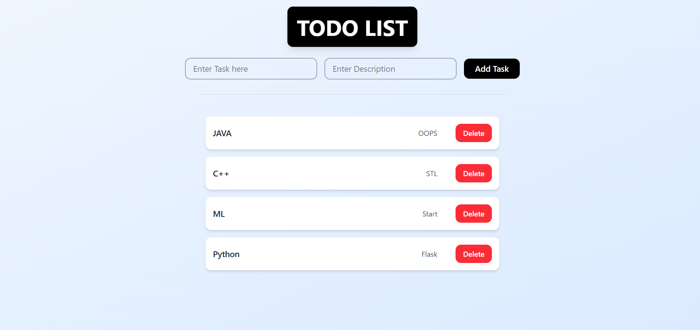

# 🚀 Next.js Firebase TODO App (Without Authentication)

A **Next.js TODO App** using **Firebase Firestore (without authentication)**, allowing **anyone to add, view, and delete tasks** in real-time.

---

## ✨ Features

✅ Add, view, and delete tasks.  
✅ Real-time updates using Firestore.  
✅ Clean, responsive UI with Tailwind CSS.  
✅ Simple Firebase setup without authentication.  
✅ Deployable on **Vercel** for your portfolio.

---

## 📸 Screenshots

---

## 🛠️ Tech Stack

- **Next.js (App Router, Client Components)**
- **Firebase Firestore (Native Mode)**
- **Tailwind CSS**
- **Vercel (Deployment)**

---

